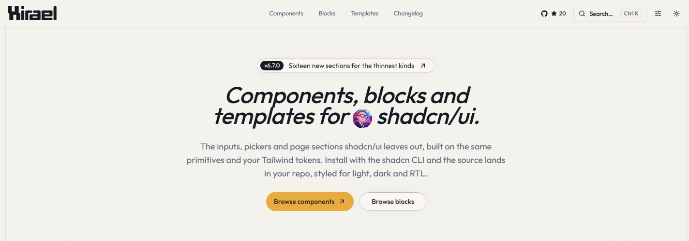
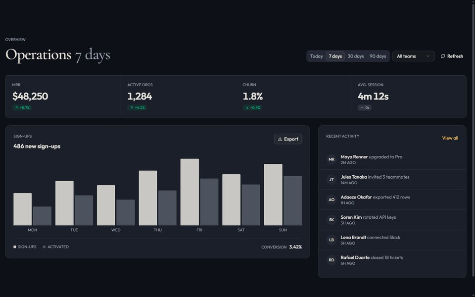
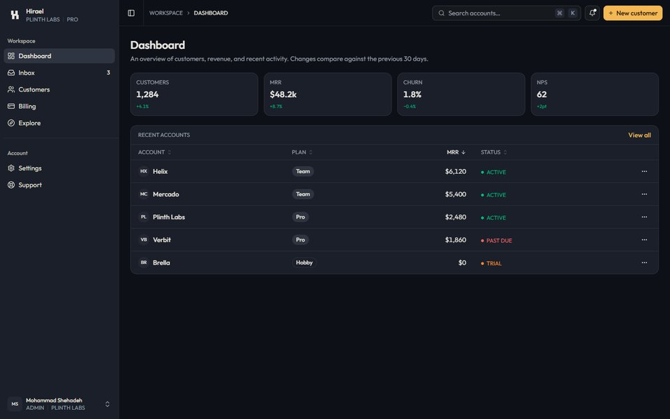
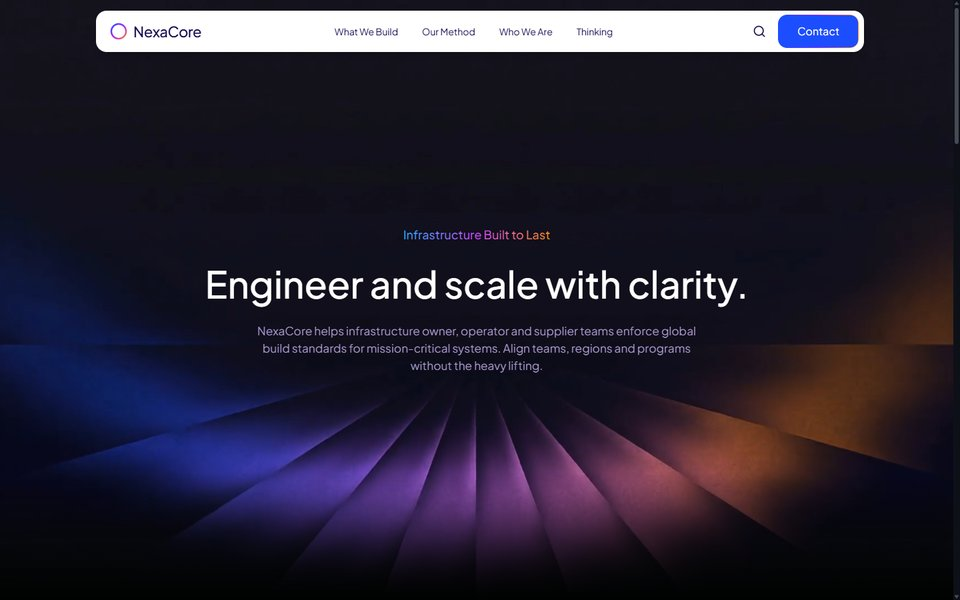

<div align="center">

<a href="https://hirael.com">
  <picture>
    <source media="(prefers-color-scheme: dark)" srcset=".github/assets/hero-dark.jpg" />
    
  </picture>
</a>

<h3>The components shadcn/ui doesn't ship.</h3>

80+ components, 140+ section blocks and 10+ full-page templates.<br />
Built on shadcn primitives, installed with the shadcn CLI, owned by you.

<p>
  <a href="https://github.com/MohammadShehadeh/hirael/stargazers"></a>
  <a href="https://ui.shadcn.com/docs/directory"></a>
  <a href="#radix-ui-or-base-ui"></a>
  <a href="#license"></a>
</p>

**[Website](https://hirael.com)** · [Components](https://hirael.com/components) · [Blocks](https://hirael.com/blocks) · [Templates](https://hirael.com/templates) · [Changelog](https://hirael.com/changelog)

</div>

```bash
npx shadcn@latest add @hirael/multi-select
```

No setup needed. Hirael is listed in shadcn's registry directory, so any project
that uses shadcn/ui can install from it right away.

## Previews

<table>
  <tr>
    <td width="50%"><a href="https://hirael.com/templates/velorah"></a></td>
    <td width="50%"><a href="https://hirael.com/templates/mindloop"></a></td>
  </tr>
  <tr>
    <td><a href="https://hirael.com/blocks/dashboard/dashboard-01"></a></td>
    <td><a href="https://hirael.com/blocks/hero/hero-10"></a></td>
  </tr>
  <tr>
    <td><a href="https://hirael.com/blocks/pricing/pricing-04"></a></td>
    <td><a href="https://hirael.com/blocks/app-shell/app-shell-01"></a></td>
  </tr>
  <tr>
    <td><a href="https://hirael.com/templates/rivr"></a></td>
    <td><a href="https://hirael.com/templates/nexacore"></a></td>
  </tr>
</table>

<p align="center">Every preview is live on <a href="https://hirael.com">hirael.com</a>, with light, dark and RTL toggles.</p>

## Why Hirael

- **You own the code.** The shadcn CLI copies each component's source into your
  project and adjusts the imports to match your setup. There is no package to
  keep updated, and you can change anything you like.
- **It works like shadcn/ui.** Components are built from small parts you put
  together, the same way shadcn/ui's own components are. They use the shadcn
  primitives already in your project.
- **Radix UI or Base UI.** Every component, block and template comes in both
  versions, so you can use whichever library your project is built on.
- **Your theme, in light, dark and right-to-left.** Colors come from your
  shadcn/ui theme, so everything matches your design without extra styling.
  Layouts also work in right-to-left languages like Arabic.
- **Easy to use with AI editors.** Every component has a Markdown page with its
  install command, usage, source code and props, and the whole library is
  summarized in [`llms.txt`](https://hirael.com/llms.txt). Share a link with
  Cursor, Claude or v0 and it has everything it needs.

## What's inside

|                        |                                                                                                                |
| ---------------------- | -------------------------------------------------------------------------------------------------------------- |
| **Inputs**             | multi-select, tag input, phone, currency, address, credit card, mention, password, duration, number range      |
| **Pickers**            | date, date range, time, month, year, color, emoji, country                                                     |
| **Files and media**    | file dropzone, image cropper, avatar upload, signature pad, lightbox, image compare, audio player              |
| **Data**               | data table, kanban, tree view, JSON viewer, diff viewer, YAML editor, cron editor, calendar heatmap, sparkline |
| **Overlays and flows** | command palette, product tour, dock, stepper, confirm dialog, unsaved-changes guard, table of contents         |
| **Motion**             | marquee, text reveal, scroll reveal, animated number, spotlight card, tilt card, morphing dialog               |
| **Blocks**             | hero, feature, pricing, FAQ, auth, dashboard, app shell, ecommerce, AI chat, cloud console, changelog and more |
| **Templates**          | complete landing pages, portfolios and SaaS sites, ready to edit                                               |

## Quick start

**1. Set up shadcn/ui** if your project doesn't use it yet.

```bash
npx shadcn@latest init
```

**2. Add the components you need.** The CLI also installs anything they depend
on, including the shadcn/ui components they're built from.

```bash
npx shadcn@latest add @hirael/multi-select @hirael/date-range-picker @hirael/pricing-04
```

**3. Use them in your code.**

```tsx
'use client';

import { useState } from 'react';

import { MultiSelect, MultiSelectContent, MultiSelectTrigger } from '@/components/multi-select';

const frameworks = [
  { value: 'next', label: 'Next.js' },
  { value: 'remix', label: 'Remix' },
  { value: 'astro', label: 'Astro' },
];

export function FrameworkPicker() {
  const [value, setValue] = useState<string[]>([]);

  return (
    <MultiSelect value={value} onValueChange={setValue} options={frameworks}>
      <MultiSelectTrigger placeholder="Pick frameworks" />
      <MultiSelectContent searchPlaceholder="Filter" />
    </MultiSelect>
  );
}
```

### Using Base UI

The commands above install the Radix UI version. If your project uses Base UI,
install from the `base` path instead:

```bash
npx shadcn@latest add https://hirael.com/r/base/multi-select.json
```

## Support Hirael

Hirael is free and MIT licensed. If it saved you a few hours:

- **[Star the repo](https://github.com/MohammadShehadeh/hirael/stargazers).** It is the main way other developers find it.
- **Share a link** to a component or block you liked.
- **[Sponsor the work](https://github.com/sponsors/MohammadShehadeh)** to keep new components coming.
- **[Request a component](https://github.com/MohammadShehadeh/hirael/issues/new?template=feature_request.yml)** shadcn/ui doesn't have.

Sponsored by [Sahabti](https://sahabti.com/en).

<a href="https://star-history.com/#MohammadShehadeh/hirael&Date">
  <picture>
    <source media="(prefers-color-scheme: dark)" srcset="https://api.star-history.com/svg?repos=MohammadShehadeh/hirael&type=Date&theme=dark" />
    
  </picture>
</a>

## Contributing

Contributions are welcome, from bug fixes to new components and blocks. Please
read the **[contributing guide](./CONTRIBUTING.md)** to learn how the project is
organized and how to submit a change, and follow our
**[Code of Conduct](./CODE_OF_CONDUCT.md)**.

<a href="https://github.com/MohammadShehadeh/hirael/graphs/contributors">
  
</a>

<details>
<summary><strong>Running the site locally</strong></summary>

<br />

This repository is the Hirael website. It previews every component, block and
template, and serves the files the shadcn CLI installs from. You'll need
Node.js 24 and pnpm 12.

```bash
git clone https://github.com/MohammadShehadeh/hirael.git
cd hirael
pnpm install
pnpm dev
```

The site runs at [http://localhost:3000](http://localhost:3000).

| Command          | What it does                                              |
| ---------------- | --------------------------------------------------------- |
| `pnpm dev`       | Starts the development server                             |
| `pnpm build`     | Builds the registry and exports the static site to `out/` |
| `pnpm test`      | Runs the tests                                            |
| `pnpm lint`      | Checks the code with ESLint                               |
| `pnpm typecheck` | Checks the TypeScript types                               |

See the [contributing guide](./CONTRIBUTING.md) for how the code is organized.

</details>

## Security

Please report security vulnerabilities privately, as described in
**[SECURITY.md](./SECURITY.md)**.

## License

MIT © [Mohammad Shehadeh](https://github.com/MohammadShehadeh). See **[LICENSE](./LICENSE)**.
